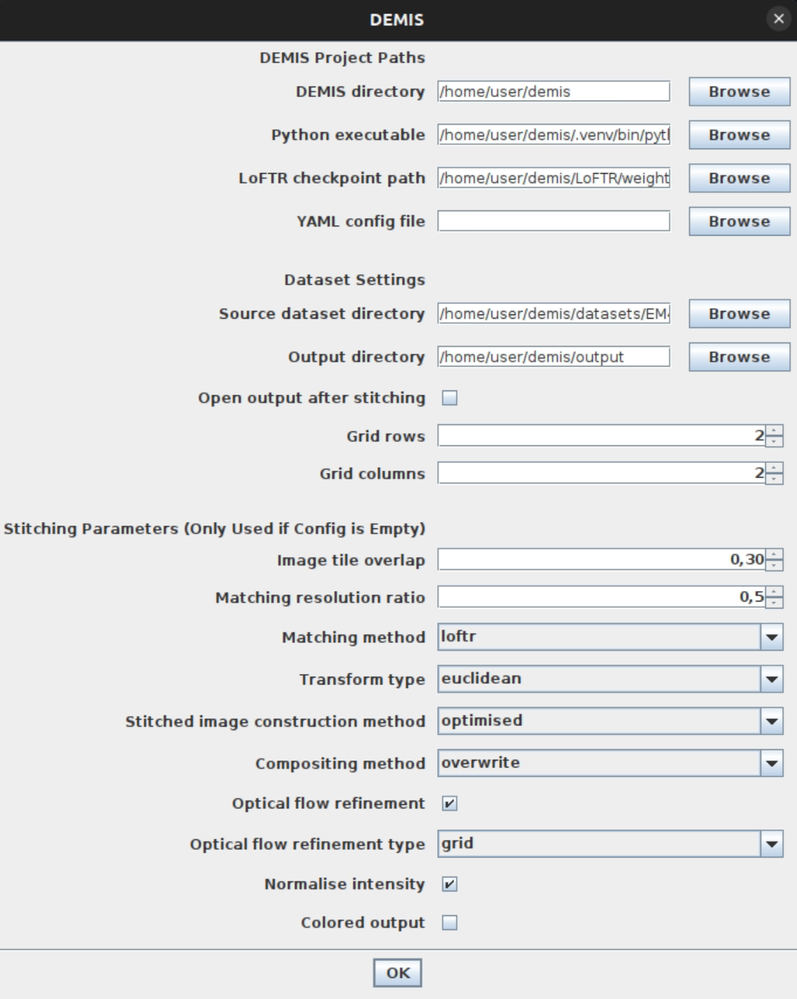

# ImageJ Plugin for DEMIS

This plugin integrates DEMIS into [ImageJ2](https://imagej.net/software/imagej2/) and
[Fiji](https://imagej.net/software/fiji/), providing a graphical user interface for stitching electron microscopy
image grids. It acts as a wrapper that executes the DEMIS CLI in the background.

## Prerequisites

1.  **DEMIS installed**: You must have the DEMIS Python project cloned and the `uv` environment set up on your machine.
2.  **ImageJ or Fiji**: An installation of ImageJ or Fiji.
3.  **Java and Maven**: If you want to build the plugin from source, you will also need JDK 8 and Maven.

## Installation from Update Site

TBD: Currently requested. Will enable installation directly via URL download.

## Building the Plugin

The plugin is a Maven project. To build it, run the following command from the `imagej/` directory:

```bash
mvn package
```

This will generate a JAR file `DEMIS-<version>.jar` in the `target/` directory. More details on ImageJ plugin
development can be found in the official [ImageJ documentation](https://imagej.net/develop/plugins).

### Installation from JAR

1.  Locate the generated JAR file in `imagej/target/`.
2.  Copy this JAR file to the `plugins/` directory of your ImageJ or Fiji installation.
3.  Restart ImageJ/Fiji. The plugin should now be loaded and appear under **Plugins > Stitching > DEMIS**.

## Usage

When you launch the plugin, the following configuration dialog will appear:



You should fill the dialog based on your stitching requirements. Once you press `OK`, the plugin will automatically
construct a command for DEMIS CLI in the background and run the stitching, optionally displaying the results. The
progress and any potential errors will be logged to ImageJ log console.

### 1. DEMIS Project Paths

- **DEMIS directory**: Absolute path to the root of your DEMIS repository (e.g., `/home/user/demis`).
- **Python executable**: Path to the Python executable within your `uv` environment. You can find this by running `uv run which python` in the DEMIS directory.
- **LoFTR checkpoint**: Path to the `.ckpt` weights file for LoFTR. Only required if you want to use LoFTR.
- **YAML config file**: Optional path to a DEMIS YAML configuration file.

### 2. Dataset Settings

- **Source dataset**: Directory containing the image tiles to stitch. The files need to be formatted as a generic
[dataset](../docs/datasets.md).
- **Output directory**: Directory where results will be saved.
- **Open output after stitching**: If checked, the stitched images will be automatically opened in ImageJ upon
completion. Will use a lot of system memory on large datasets.
- **Grid rows/cols**: Dimensions of the grid in the stitched dataset.

### 3. Stitching Parameters

The stitching parameters are used only when no YAML config is provided. Full explanation of the options can be found in
[configuration documentation](../docs/configuration.md).

- **Overlap**: Expected tile overlap.
- **Resolution ratio**: Downscaling factor for feature matching.
- **Matching method**: Feature matching method.
- **Transform**: Type of estimated geometric transformations.
- **Construction**: Grid construction method.
- **Compositing**: Image blending method.
- **Optical flow refinement**: Optical flow refinement of estimated transformations.
- **Normalise intensity**: Image tile normalization.
